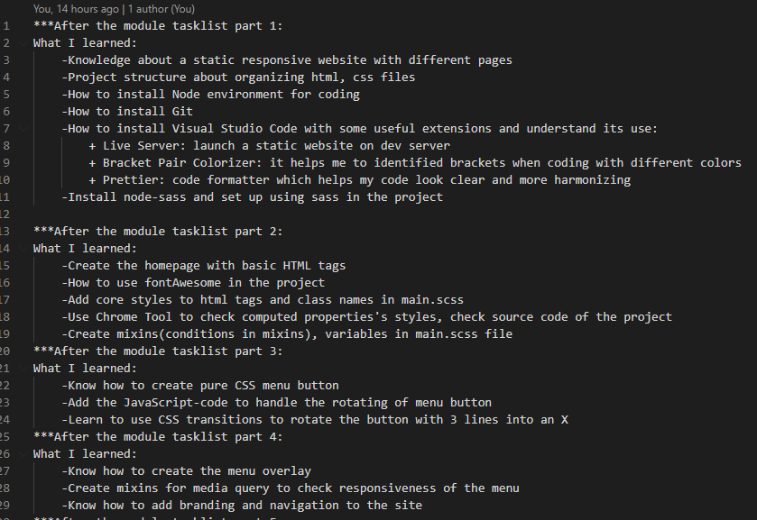

# LUT Front End Course

This repository is made by  emonmohiuddin, student number is: x108605, student email is:  emonmohiuddin@yahoo.com

This repository contains 2 folders: CourseWork and CourseProject

The link to the project I completed: https://jocular-bonbon-0389f8.netlify.app/

The link to a video of project running: https://drive.google.com/drive/u/4/folders/1BewiQV0YQHm6lxn-pMShxVQu8BAD7Cd-

## Coursework
This folder is implemented according to the [videos](https://www.youtube.com/watch?v=gYzHS-n2gqU&list=PLillGF-RfqbYoGoCjKoMOkVznV6aSXKzU) on Youtube from LUT. 

Inside this folder also contain a diary.txt  file which is what I have learnt through these videos.

This folder also include the PDF file for learning diary(FrontEndCourse_learning_diary.pdf) according to the template from LUT.
## Project
This folder is made to show my own project according to the knowledge I learned through CourseWork.

## Installation

Use npm package for installation to run the project.
```bash
npm install
```
Use npm run sass to see the changes made in scsss files and compiled to css files .
```bash
npm run sass
```
## License
[MIT](https://choosealicense.com/licenses/mit/)
